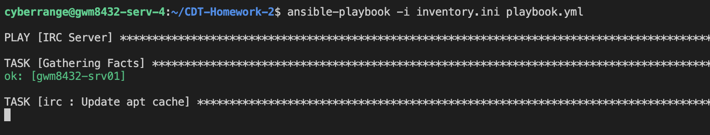

# Deployment Documentation

## 1. Prerequisites

### OS and Tools
- Ubuntu 22.04 x3 (1 for the server, 2 for the clients)
- Ansible 2.10.8
- Python 3.10.12

### Network Requirements
&emsp;The clients must be on the same network as the server, or the server must be publicly accessible in order for this deployment to work. The goal for how this would be used in a competition would be that the IRC clients are able to send messages setup by the python scripts while red team would not have access to the clients (so they can't just happen to find the flag in the scripts). Red team would be on the same network as the server, or would have access to the publicly accessible server, but would need to find the password in order to join the channel. Creating another flag there is not within the scope of the assignment, but that could potentially be used for injects or other flags. Port 6667 must be allowed for ingress and egress if there's a firewall on the server already.

### Manual Setup
&emsp;There's no manual setup needed before running Ansible other than making sure that the machines have the prerequisites.

## 2. Installation and Configuration

### Ansible-playbook Running Instructions
With your working directory being the CDT-Homework-2 directory, run:
- ``ansible-playbook -i inventory.ini playbook.yml``
