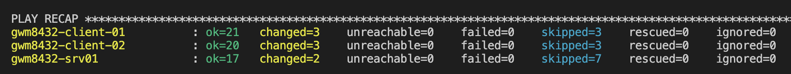
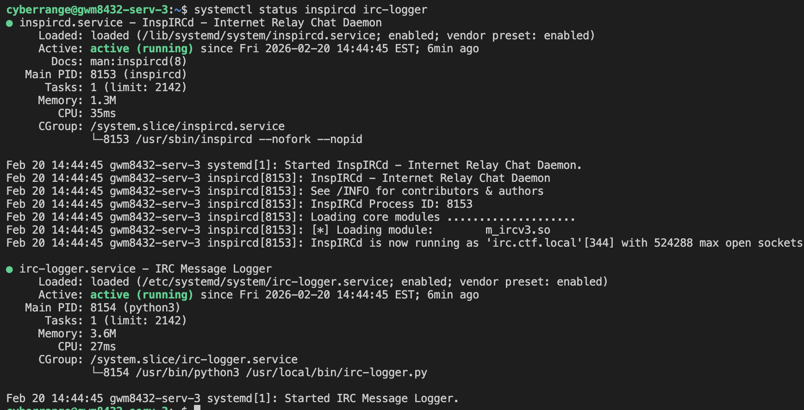
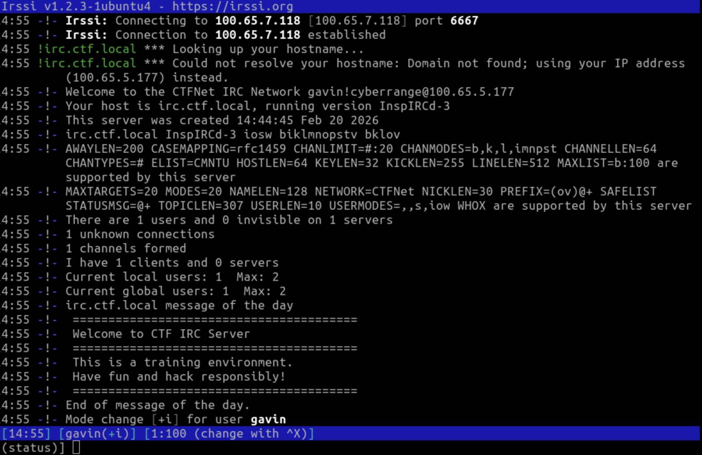
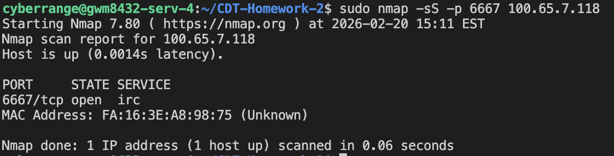
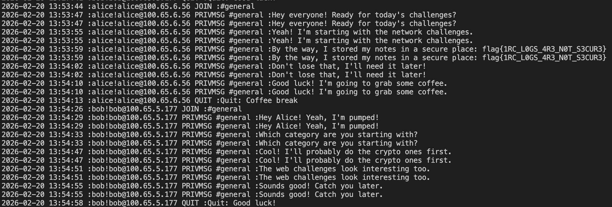

# Deployment Documentation

## 1. Prerequisites

### OS and Tools
- Ubuntu 22.04 x3 (1 for the server, 2 for the clients)
- Ansible 2.10.8
- Python 3.10.12

### Network Requirements
&emsp;The clients must be on the same network as the server, or the server must be publicly accessible in order for this deployment to work. The goal for how this would be used in a competition would be that the IRC clients are able to send messages setup by the python scripts while red team would not have access to the clients (so they can't just happen to find the flag in the scripts). Red team would be on the same network as the server, or would have access to the publicly accessible server, but would need to find the password in order to join the channel. Creating another flag there is not within the scope of the assignment, but that could potentially be used for injects or other flags. Port 6667 must be allowed for ingress and egress if there's a firewall on the server already.

### Manual Setup
&emsp;There's no manual setup needed before running Ansible other than making sure that the machines have the prerequisites.

## 2. Installation and Configuration

### Ansible-playbook Running Instructions
With your working directory being the CDT-Homework-2 directory, run:
- ``ansible-playbook -i inventory.ini playbook.yml``
* NOTE: This will not work as of currently because the machines will have already been removed. If you wish to reproduce this, you must first change the IP addresses, usernames, and passwords of the machines inside of the inventory file to match those of the machines you'll be using.

Here's the playbook starting:
[Playbook starting](../screenshots/ircstart.png)
Here's the playbook ending:

Here's the server showing that inspircd (IRC Server) and irc-logger (python message logging bot) are both running

Here's a screenshot showing that anyone can connect with the password, ip, and port (in this instance irssi was used)

nmap showing that the IRC server port is open


### Command Expected Output
```~/CDT-Homework-2$ ansible-playbook -i inventory.ini playbook.yml 

PLAY [IRC Server] **********************************************************************************************************************************************************************************************

TASK [Gathering Facts] *****************************************************************************************************************************************************************************************
ok: [gwm8432-srv01]

TASK [irc : Update apt cache] **********************************************************************************************************************************************************************************
ok: [gwm8432-srv01]

TASK [irc : Install required packages] *************************************************************************************************************************************************************************
ok: [gwm8432-srv01]

TASK [irc : Create IRC server directory] ***********************************************************************************************************************************************************************
ok: [gwm8432-srv01]

TASK [irc : Create IRC log directory with weak permissions (VULNERABILITY 1)] **********************************************************************************************************************************
ok: [gwm8432-srv01]

TASK [irc : Configure InspIRCd with logging enabled] ***********************************************************************************************************************************************************
ok: [gwm8432-srv01]

TASK [irc : Create MOTD file] **********************************************************************************************************************************************************************************
ok: [gwm8432-srv01]

TASK [irc : Create rules file] *********************************************************************************************************************************************************************************
ok: [gwm8432-srv01]

TASK [irc : Create IRC logging bot] ****************************************************************************************************************************************************************************
ok: [gwm8432-srv01]

TASK [irc : Create systemd service for IRC logger] *************************************************************************************************************************************************************
ok: [gwm8432-srv01]

TASK [irc : Start IRC logger service] **************************************************************************************************************************************************************************
ok: [gwm8432-srv01]

TASK [irc : Ensure InspIRCd service is enabled and started] ****************************************************************************************************************************************************
changed: [gwm8432-srv01]

TASK [irc : Wait for IRC server to be ready] *******************************************************************************************************************************************************************
ok: [gwm8432-srv01]

TASK [irc : Install IRC client and dependencies] ***************************************************************************************************************************************************************
ok: [gwm8432-srv01]

TASK [irc : Create IRC client scripts directory] ***************************************************************************************************************************************************************
ok: [gwm8432-srv01]

TASK [irc : Create python script for client 1 (flag holder)] ***************************************************************************************************************************************************
skipping: [gwm8432-srv01]

TASK [irc : Create python script for client 2] *****************************************************************************************************************************************************************
skipping: [gwm8432-srv01]

TASK [irc : Wait for IRC server to be fully ready] *************************************************************************************************************************************************************
ok: [gwm8432-srv01]

TASK [irc : Execute client 1 script (Alice with flag)] *********************************************************************************************************************************************************
skipping: [gwm8432-srv01]

TASK [irc : Display client 1 client1_output] *******************************************************************************************************************************************************************
skipping: [gwm8432-srv01]

TASK [irc : Wait between clients] ******************************************************************************************************************************************************************************
skipping: [gwm8432-srv01]

TASK [irc : Execute client 2 script (Bob)] *********************************************************************************************************************************************************************
skipping: [gwm8432-srv01]

TASK [irc : Display client 2 output] ***************************************************************************************************************************************************************************
skipping: [gwm8432-srv01]

TASK [irc : Set permissive permissions on message log (VULNERABILITY 6)] ***************************************************************************************************************************************
changed: [gwm8432-srv01]

PLAY [IRC Clients Setup] ***************************************************************************************************************************************************************************************

TASK [Gathering Facts] *****************************************************************************************************************************************************************************************
ok: [gwm8432-client-01]
ok: [gwm8432-client-02]

TASK [irc : Update apt cache] **********************************************************************************************************************************************************************************
ok: [gwm8432-client-01]
ok: [gwm8432-client-02]

TASK [irc : Install required packages] *************************************************************************************************************************************************************************
ok: [gwm8432-client-01]
ok: [gwm8432-client-02]

TASK [irc : Create IRC server directory] ***********************************************************************************************************************************************************************
ok: [gwm8432-client-01]
ok: [gwm8432-client-02]

TASK [irc : Create IRC log directory with weak permissions (VULNERABILITY 1)] **********************************************************************************************************************************
ok: [gwm8432-client-01]
ok: [gwm8432-client-02]

TASK [irc : Configure InspIRCd with logging enabled] ***********************************************************************************************************************************************************
ok: [gwm8432-client-01]
ok: [gwm8432-client-02]

TASK [irc : Create MOTD file] **********************************************************************************************************************************************************************************
ok: [gwm8432-client-01]
ok: [gwm8432-client-02]

TASK [irc : Create rules file] *********************************************************************************************************************************************************************************
ok: [gwm8432-client-01]
ok: [gwm8432-client-02]

TASK [irc : Create IRC logging bot] ****************************************************************************************************************************************************************************
ok: [gwm8432-client-01]
ok: [gwm8432-client-02]

TASK [irc : Create systemd service for IRC logger] *************************************************************************************************************************************************************
ok: [gwm8432-client-01]
ok: [gwm8432-client-02]

TASK [irc : Start IRC logger service] **************************************************************************************************************************************************************************
ok: [gwm8432-client-01]
ok: [gwm8432-client-02]

TASK [irc : Ensure InspIRCd service is enabled and started] ****************************************************************************************************************************************************
changed: [gwm8432-client-01]
changed: [gwm8432-client-02]

TASK [irc : Wait for IRC server to be ready] *******************************************************************************************************************************************************************
ok: [gwm8432-client-01]
ok: [gwm8432-client-02]

TASK [irc : Install IRC client and dependencies] ***************************************************************************************************************************************************************
ok: [gwm8432-client-01]
ok: [gwm8432-client-02]

TASK [irc : Create IRC client scripts directory] ***************************************************************************************************************************************************************
ok: [gwm8432-client-01]
ok: [gwm8432-client-02]

TASK [irc : Create python script for client 1 (flag holder)] ***************************************************************************************************************************************************
skipping: [gwm8432-client-02]
ok: [gwm8432-client-01]

TASK [irc : Create python script for client 2] *****************************************************************************************************************************************************************
skipping: [gwm8432-client-01]
ok: [gwm8432-client-02]

TASK [irc : Wait for IRC server to be fully ready] *************************************************************************************************************************************************************
ok: [gwm8432-client-01]
ok: [gwm8432-client-02]

TASK [irc : Execute client 1 script (Alice with flag)] *********************************************************************************************************************************************************
skipping: [gwm8432-client-02]
changed: [gwm8432-client-01]

TASK [irc : Display client 1 client1_output] *******************************************************************************************************************************************************************
ok: [gwm8432-client-01] => {
    "client1_output.stdout_lines": [
        "[*] Alice finished"
    ]
}
skipping: [gwm8432-client-02]

TASK [irc : Wait between clients] ******************************************************************************************************************************************************************************
Pausing for 3 seconds
(ctrl+C then 'C' = continue early, ctrl+C then 'A' = abort)
ok: [gwm8432-client-01]

TASK [irc : Execute client 2 script (Bob)] *********************************************************************************************************************************************************************
skipping: [gwm8432-client-01]
changed: [gwm8432-client-02]

TASK [irc : Display client 2 output] ***************************************************************************************************************************************************************************
skipping: [gwm8432-client-01]
ok: [gwm8432-client-02] => {
    "client2_output.stdout_lines": [
        "[*] Bob finished"
    ]
}

TASK [irc : Set permissive permissions on message log (VULNERABILITY 6)] ***************************************************************************************************************************************
changed: [gwm8432-client-01]
changed: [gwm8432-client-02]

PLAY RECAP *****************************************************************************************************************************************************************************************************
gwm8432-client-01          : ok=21   changed=3    unreachable=0    failed=0    skipped=3    rescued=0    ignored=0   
gwm8432-client-02          : ok=20   changed=3    unreachable=0    failed=0    skipped=3    rescued=0    ignored=0   
gwm8432-srv01              : ok=17   changed=2    unreachable=0    failed=0    skipped=7    rescued=0    ignored=0
```

### Troubleshooting

&emsp;There isn't much troubleshooting needed for this. It's pretty straightforward, but if there's any issues that do arrise, it is likely from the inventory file, make sure to add an inventory file with the correct ip addresses and passwords set before running the playbook. Also make sure that the deployment machine's public key is on each machine's ~/.ssh/authorized_keys file.

## 3. Verification

To verify, check /var/log/ircd/messages.log. If there's output here, it means that the python bot is logging things. If the flag is active, and messages from both Bob and Alice are showing up, it means that the clients ran the python scripts and the flag is in the messages.log file. Here's what that would look like:

